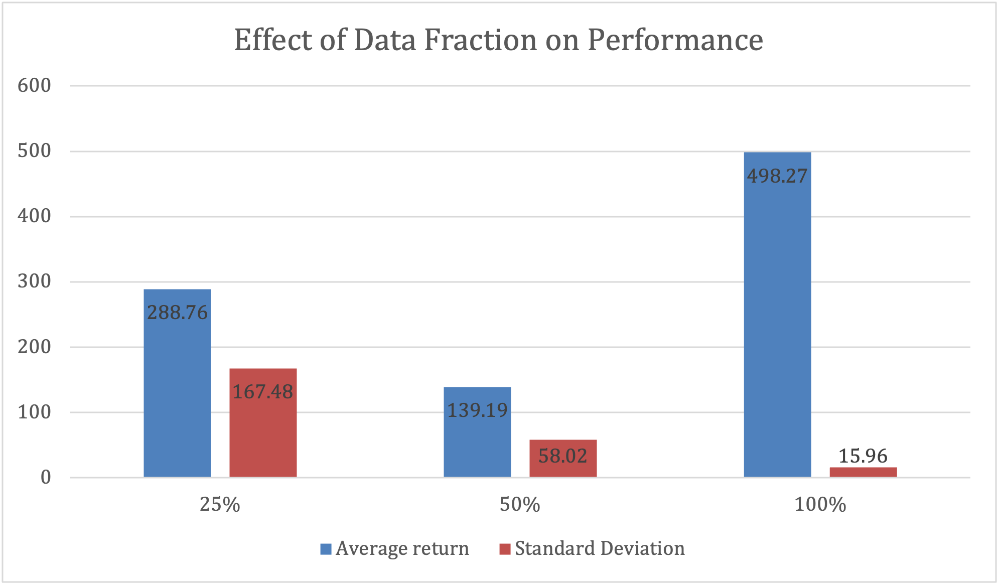
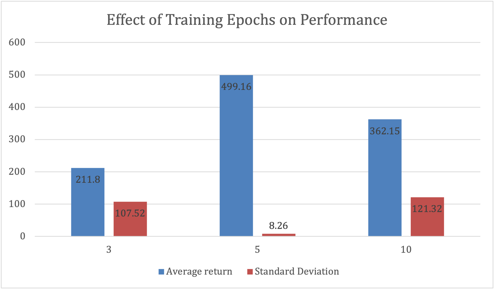
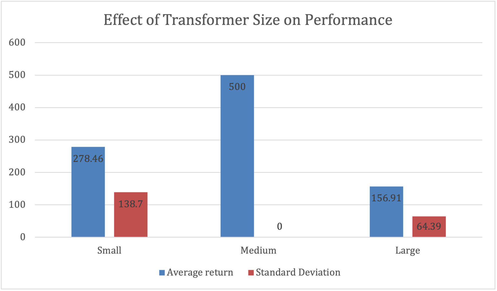

# 🧠 Decision Transformer Performance Analysis on CartPole-v1

**Author:** Jaeha Lee (The Ohio State University)  
**GitHub Repository:** [https://github.com/dlwogk7939/decision-transformer-cartpole](https://github.com/dlwogk7939/decision-transformer-cartpole)

---

## 📄 Abstract
This experiment investigates how the performance of a **Decision Transformer** varies with three primary factors:  
(1) the amount of expert data, (2) the number of training epochs, and (3) the transformer model size.  

Using the offline **CartPole-v1** dataset collected from a PPO expert policy, we trained multiple transformer configurations to predict the next action given the **return-to-go (RTG)**, **4-dimensional state**, and **previous action**.  
Results demonstrate that the balance between model capacity and dataset size critically determines generalization performance.

---

## ⚙️ Method

We implemented a Decision Transformer using **PyTorch**, following the structure described in *Chen et al. (2021)*.  
The dataset was generated from a **PPO agent** trained with **Stable-Baselines3** for 20,000 timesteps.  
Each model was trained to predict the next action in an offline imitation learning setting.

| Parameter | Values |
|------------|---------|
| **Data Fraction** | 25%, 50%, 100% |
| **Epochs** | 3, 5, 10 |
| **Transformer Size** | Small (64 hidden, 2 layers, 2 heads)   Medium (128 hidden, 3 layers, 2 heads)   Large (256 hidden, 4 layers, 4 heads) |

---

## 📊 Results

The Decision Transformer’s performance was evaluated under different conditions:  

### **1️⃣ Effect of Data Fraction**
| Data Fraction | Avg Return (± Std) |
|---------------|--------------------|
| 25% | 288.76 ± 167.48 |
| 50% | 139.19 ± 58.02 |
| 100% | 498.27 ± 15.96 |

### **2️⃣ Effect of Epochs**
| Epochs | Avg Return (± Std) |
|---------|--------------------|
| 3 | 211.80 ± 107.52 |
| 5 | 499.16 ± 8.26 |
| 10 | 362.15 ± 121.32 |

### **3️⃣ Effect of Transformer Size**
| Transformer Size | Avg Return (± Std) |
|------------------|--------------------|
| Small | 278.46 ± 138.70 |
| Medium | 500.00 ± 0.00 |
| Large | 156.91 ± 64.39 |

---

## 💬 Discussion

The results indicate that the Decision Transformer's performance depends strongly on **data size**, **model capacity**, and **the number of training epochs**.  
The model achieved the best performance when trained with the **full dataset**, a **medium-sized transformer**, and **five epochs**.  

- Larger models suffered from **overparameterization**, having too many parameters relative to the dataset, which led to **overfitting** and **unstable optimization**.  
- Smaller models lacked sufficient representational power, resulting in **underfitting**.  

These findings suggest that **balanced model complexity** is essential for stable **offline reinforcement learning**.

---

## 🏁 Conclusion

For the **CartPole-v1** environment, the best performing configuration was:  
> **Data Fraction: 100%, Epochs: 5, Transformer Size: Medium (128 hidden, 3 layers, 2 heads)**  

This configuration achieved an average return of approximately **500 ± 0** over 100 episodes, demonstrating that the Decision Transformer can reproduce near-optimal expert performance when properly tuned.

---

## 📚 References

- Chen, L., Lu, K., Rajeswaran, A., Lee, K., Grover, A., & Mordatch, I. (2021). *Decision Transformer: Reinforcement Learning via Sequence Modeling.* NeurIPS 2021.  
- Stable-Baselines3: [https://github.com/DLR-RM/stable-baselines3](https://github.com/DLR-RM/stable-baselines3)  
- Original Decision Transformer Implementation: [https://github.com/kzl/decision-transformer](https://github.com/kzl/decision-transformer)  
- Repository for this project: [https://github.com/dlwogk7939/decision-transformer-cartpole](https://github.com/dlwogk7939/decision-transformer-cartpole)

---

## 📈 Example Graphs (from report)

  
   
  

*(These graphs visualize how performance changes with data fraction, epoch count, and transformer size.)*

---
